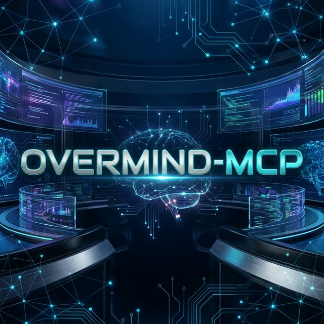

# 🧠 OverMind-MCP

_Orchestrateur universel agents IA multi-modeles via MCP pour piloter Claude-Code, Gemini-cli, Qwen, Kilo/Cline, OpenClaw, GLM, Minimax, Kimi, Ollama et plus sans limite._



<p align="center">
  <a href="https://discord.gg/4AR82phtBz"></a>
  <a href="https://deamondev888.github.io/overmind-mcp/"></a>
</p>

## 👋 C'est quoi ?

**OverMind-MCP** est une conscience supérieure conçue pour orchestrer, commander et automatiser une flotte illimitée d'agents IA. Compatible avec **Claude-Code, Gemini-cli, Qwen-cli, Kilo/Cline, OpenClaw**, et prêt pour **GLM, Minimax, Kimi, Ollama** et bien d'autres. Plus qu'un simple runner, c'est le **Cortex Central** de votre infrastructure IA.

Il transforme les outils CLI isolés en une force coordonnée, pilotable par API ou par MCP, capable d'exécuter des missions complexes en 2 secondes chrono. de creer et d orchestrer des pipeline de plusieurs agent. il est expert en outils MCP et peu etre scripté pour les faire fonctionner ensemble et les mettre en productions

## ✨ Ce que ça fait

- **🔌 Contrôle Total** : Lancez des missions complexes via MCP ou directement via le code.
- **🏗️ Architecture Pro** : Basé sur des services (`AgentManager`, `ClaudeRunner`, `PromptManager`) pour une stabilité maximale.
- **🧠 Mémoire Haute-Performance (4096D)** : Système RAG intégré via PostgreSQL + `pgvector` supportant les embeddings SOTA (Qwen 8B).
- **🛡️ Mémoire Ségréguée** : Chaque agent peut posséder ses propres souvenirs isolés tout en ayant accès au socle de connaissances global.
- **🛠️ Capacités Étendues** : L'agent piloté peut utiliser VOS outils (Base de données, Scrapers, etc.).
- **🤖 Multi-Agents** : Créez, configurez et gérez des personnalités d'agents isolées (Prompts & Settings dédiés).
- **📦 Prêt pour l'Intégration** : Importable comme un module NPM dans vos autres projets.

---

## 🚀 Commencer (Guide Facile)

### Option 1 : Utilisation Globale ou Package distant NPM

Si vous souhaitez l'installer globalement sans cloner de repo, vous pouvez utiliser :

```bash
npm install -g overmind-mcp
```

**Configuration MCP (Client) pour l'Option 1 :**
Pour connecter l'orchestrateur distant à un client ou à Cursor,Antigravity ou Claude Code, pointez simplement via `npx` :

```json
{
  "mcpServers": {
    "overmind": {
      "command": "npx",
      "args": ["-y", "overmind-mcp@latest"]
    }
  }
}
```

---

### Option 2 : Installation Locale (Développement ou hébergement précis)

```bash
# 1. Cloner le repo localement
git clone https://github.com/DeamonDev888/overmind-mcp overmind-mcp
cd overmind-mcp

# 2. Installer les dépendances
pnpm install

# 3. Build le projet
pnpm run build
```

Pour que l'agent puisse voir vos autres serveurs MCP locaux, copiez le fichier d'exemple :

```bash
cp .mcp.json.example .mcp.json
```

**Configuration MCP (Client) pour l'Option 2 :**
Pour connecter ce runner à un client en pointant vers votre version locale compilée :

```json
{
  "mcpServers": {
    "overmind": {
      "command": "node",
      "args": ["/LE_CHEMIN_ABSOLU_VERS_LE_DOSSIER_CLONE/dist/bin/cli.js"]
    }
  }
}
```

---

## 📦 Utilisation comme Bibliothèque

Vous pouvez désormais importer le moteur du runner dans vos propres scripts :

```typescript
import { createServer, AgentManager, ClaudeRunner, getMemoryProvider } from 'overmind-mcp';

// 1. Gérer les agents programmatiquement
const manager = new AgentManager();
await manager.createAgent('expert-seo', 'Tu es un expert SEO...', 'claude-3-5-sonnet');

// 2. Accéder à la mémoire persistante 4096D
const memory = getMemoryProvider();
await memory.storeKnowledge({ text: 'Donnée critique...', agentName: 'expert-seo' });

// 3. Lancer une exécution sans passer par MCP
const runner = new ClaudeRunner();
const result = await runner.runAgent({
  agentName: 'expert-seo',
  prompt: 'Analyse le site example.com',
  autoResume: true,
});

console.log(result.result);
```

---

## 📂 Structure du Projet

- `src/services/` : Le cœur du système (Logique métier isolée en services).
- `src/tools/` : Les outils MCP qui appellent les services.
- `src/bin/cli.ts` : Le point d'entrée exécutable pour le terminal.
- `src/server.ts` : La définition du serveur FastMCP.
- `src/index.ts` : Les exports publics (API de la bibliothèque).
- `.claude/` : Stockage des agents (Prompts `.md` et Settings `.json`).

---


_Note : L'**OverMind** punit et martyrise les **OpenClaw** qui n'écoutent pas._ 😈

_Projet propulsé par DeaMoN888 - 2026_
