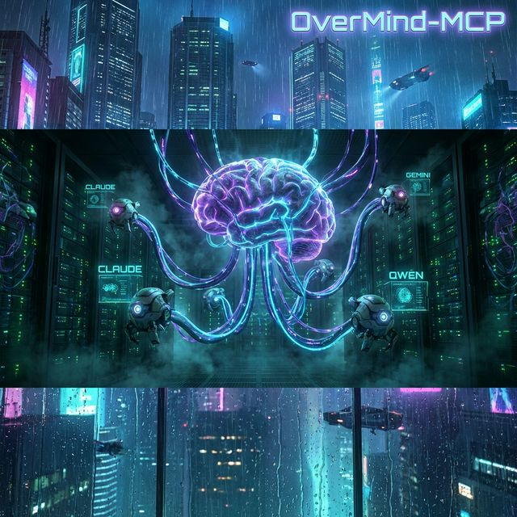
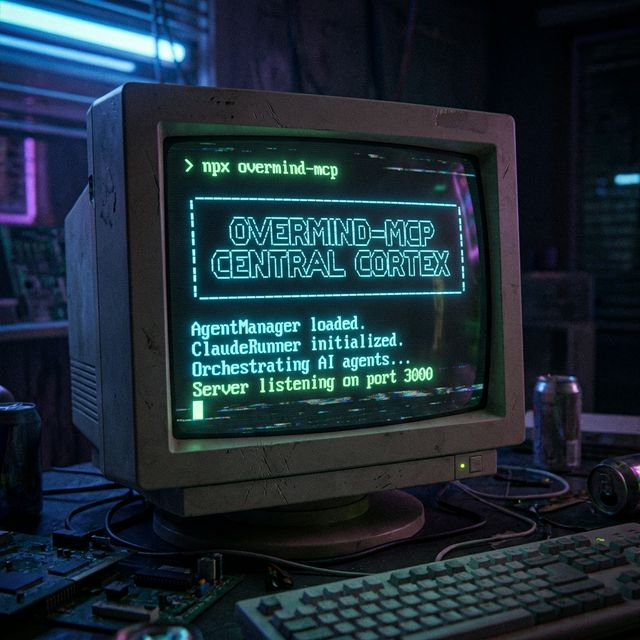

# 🧠 OverMind-MCP

_Orchestrateur universel agents IA multi-modeles via MCP pour piloter Claude-Code, Gemini, Qwen, Kilo/Cline, OpenClaw, GLM, Minimax, Kimi, Ollama et plus sans limite._



## 👋 C'est quoi ?

**OverMind-MCP** est une conscience supérieure conçue pour orchestrer, commander et automatiser une flotte illimitée d'agents IA. Compatible avec **Claude-Code, Gemini-cli, Qwen-cli, Kilo/Cline, OpenClaw**, et prêt pour **GLM, Minimax, Kimi, Ollama** et bien d'autres. Plus qu'un simple runner, c'est le **Cortex Central** de votre infrastructure IA.

Il transforme les outils CLI isolés en une force coordonnée, pilotable par API ou par MCP, capable d'exécuter des missions complexes en 2 secondes chrono.

## ✨ Ce que ça fait

- **🔌 Contrôle Total** : Lancez des missions complexes via MCP ou directement via le code.
- **🏗️ Architecture Pro** : Basé sur des services (`AgentManager`, `ClaudeRunner`, `PromptManager`) pour une stabilité maximale.
- **🛠️ Capacités Étendues** : L'agent piloté peut utiliser VOS outils (Base de données, Scrapers, etc.).
- **🤖 Multi-Agents** : Créez, configurez et gérez des personnalités d'agents isolées (Prompts & Settings dédiés).
- **📦 Prêt pour l'Intégration** : Importable comme un module NPM dans vos autres projets.

---

## 🚀 Commencer (Guide Facile)

### 1. Installation

```bash
# Installe les dépendances
pnpm install

# Build le projet (Génère les types TS et le code JS)
pnpm run build
```

### 2. Configuration MCP

Pour que l'agent puisse voir vos autres serveurs MCP, copiez le fichier d'exemple :

```bash
cp .mcp.json.example .mcp.json
```

### 3. Lancer le Serveur Standalone

Le serveur peut être lancé via le CLI dédié :

```bash
# Lancement standard
pnpm start

# Ou via le binaire directement (si installé via npm link)
overmind
```

---

## 📦 Utilisation comme Bibliothèque

Vous pouvez désormais importer le moteur du runner dans vos propres scripts :

```typescript
import { createServer, AgentManager, ClaudeRunner } from 'claude-code-runner';

// 1. Gérer les agents programmatiquement
const manager = new AgentManager();
await manager.createAgent('expert-seo', 'Tu es un expert SEO...', 'claude-3-5-sonnet');

// 2. Lancer une exécution sans passer par MCP
const runner = new ClaudeRunner();
const result = await runner.runAgent({
  agentName: 'expert-seo',
  prompt: 'Analyse le site example.com',
  autoResume: true,
});

console.log(result.result);
```

---

## 🛠️ Configuration MCP (Client)

Pour connecter ce runner à un client (Cursor, Claude Desktop, etc.), pointez vers le nouvel entrypoint CLI :

```json
{
  "mcpServers": {
    "claude-runner": {
      "command": "node",
      "args": ["/CHEMIN_VERS_PROJET/dist/bin/cli.js"]
    }
  }
}
```

---

## 📂 Structure du Projet

- `src/services/` : Le cœur du système (Logique métier isolée en services).
- `src/tools/` : Les outils MCP qui appellent les services.
- `src/bin/cli.ts` : Le point d'entrée exécutable pour le terminal.
- `src/server.ts` : La définition du serveur FastMCP.
- `src/index.ts` : Les exports publics (API de la bibliothèque).
- `.claude/` : Stockage des agents (Prompts `.md` et Settings `.json`).

---



_Projet propulsé par DeaMoN888 - 2026_
